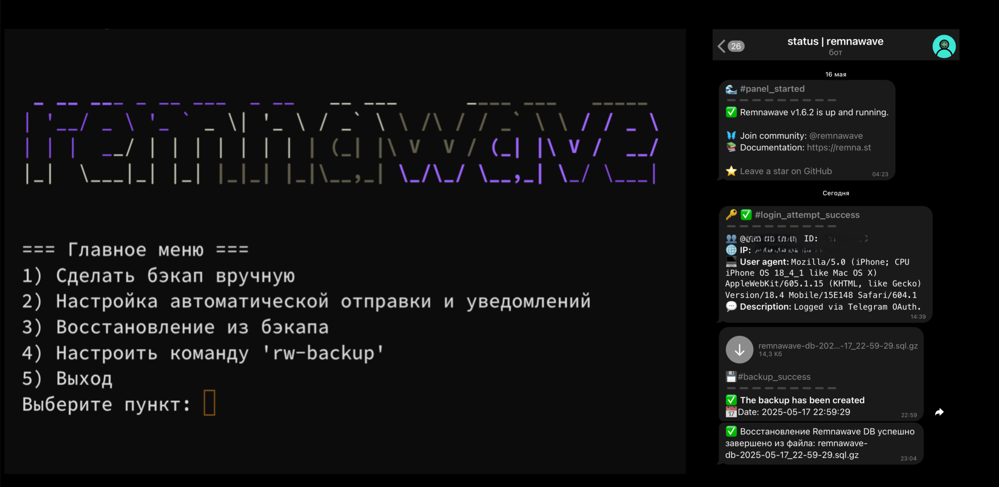

# Remnawave Backup & Restore
#       (by distillium)
Скрипт автоматизирует резервное копирование и восстановление базы данных.



## Функции:
- интерактивное меню
- уведомления в Telegram бота с прикрепленным бэкапом
- создание бэкапа вручную
- настройка автоматического запуска по расписанию
- восстановление из файла
- обновление скрипта
- удаление скрипта
- реализована политика хранения бэкапов

## Установка (требует root):
```
bash <(curl -fsSL https://raw.githubusercontent.com/distillium/remnawave-backup-restore/main/backup-restore.sh)
```
## Команды:
- `rw-backup` — быстрый доступ (при активации)
